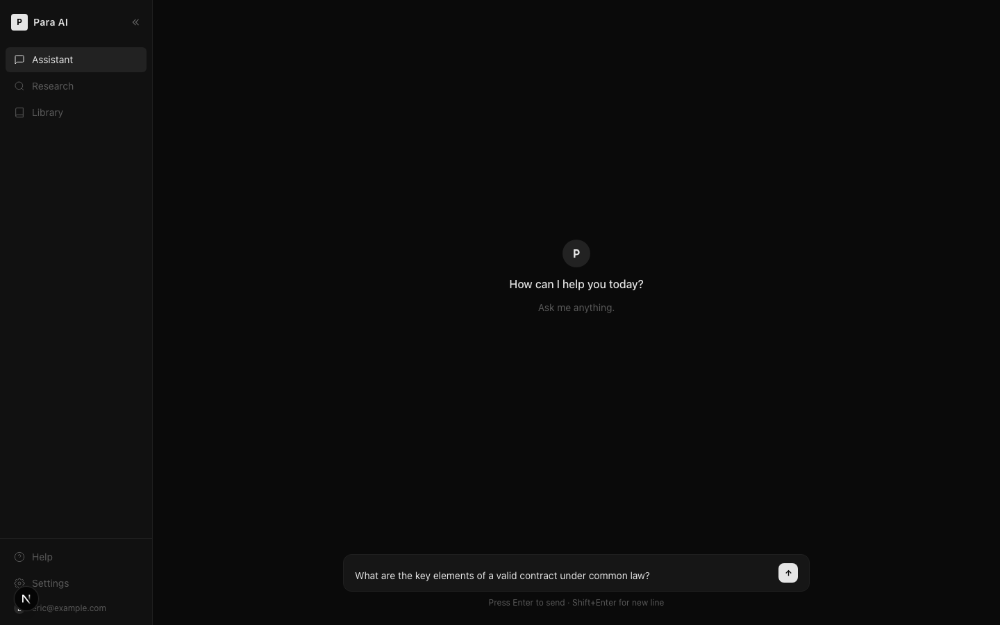
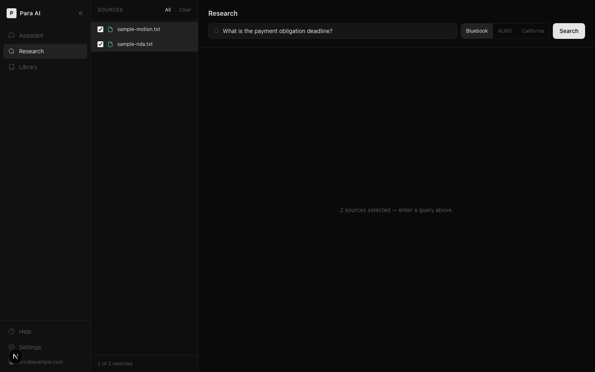
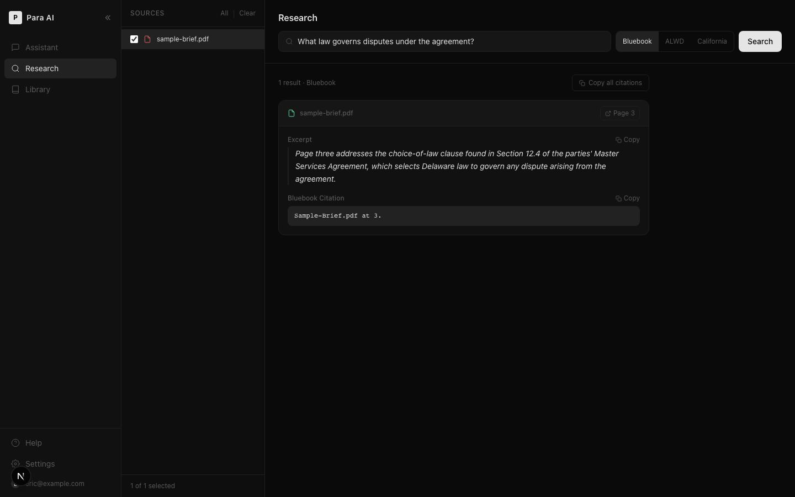
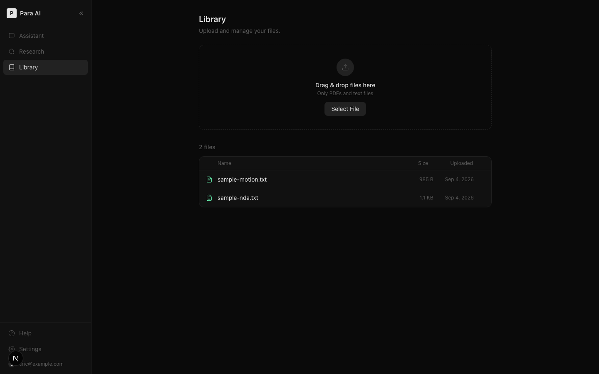
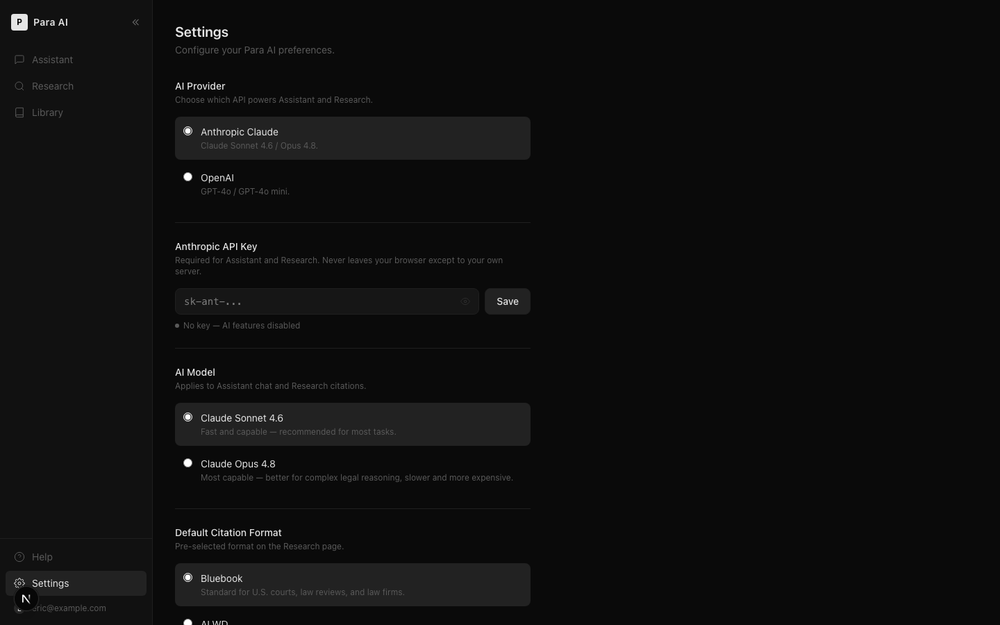

# Para AI

A legal AI assistant web app: upload documents, ask questions, get answers with citations that actually point at the page they came from. Runs on either Anthropic Claude or OpenAI — your key, your choice.

Built with Next.js, TypeScript, and Tailwind CSS.

---

## Screenshots

### Assistant
Streaming chat, powered by whichever provider is active in Settings.



### Research
Pick source documents, ask a question, get excerpts with formatted legal citations.



Citations link to the exact page they came from. PDFs are extracted page-by-page rather than as one flat blob, so "Page 3" opens the source PDF at page 3 instead of just naming a number nobody can check.



### Library
Upload and manage PDF and text files.



### Settings
Toggle between Anthropic Claude and OpenAI, each with its own API key and model.



---

## Why page-accurate citations were the hard part

Anyone can ask a model to "cite your sources." The actual work is making the citation checkable.

`pdf-parse`'s `PDFParse` class (built on `pdfjs-dist`) returns text grouped by page, not as one string — so extraction happens per page, and chunking respects page boundaries instead of splitting mid-page. That's the only reason a citation can say "Page 3" and mean it. Each document is capped at 40 pages / 40,000 characters sent to the model, so a 300-page filing doesn't blow the context window — but the cap is applied at a page boundary, never mid-page, so whatever gets through still carries an accurate page number.

Plain `.txt` files have no such thing as a page, so they get a single `page: null` chunk and no page-jump link. That's not a missing feature, it's just what a text file is.

## Two rate-limit tiers, and why they're not the same number

`/api/chat` and `/api/citations` both rate-limit per IP, but BYOK (bring-your-own-key) callers and server-key callers aren't throttled the same way — a BYOK caller is burning their own API quota, a server-key caller is burning the app owner's:

| Route | BYOK limit | Server-key limit |
|---|---|---|
| `/api/chat` | 30 / min | 5 / min |
| `/api/citations` | 15 / min | 5 / min |

The limiter itself (`app/lib/rateLimit.ts`) is a plain in-memory fixed-window bucket keyed by `ip:route:tier` — fine for one process, and it says so in a comment, because the honest answer is "swap this for Upstash Redis before this touches real traffic," not "this scales."

## Settings survive the schema changing under them

Per-provider settings (`app/hooks/useSettings.ts`) used to be a single `apiKey`/`model` pair before OpenAI support existed. Rather than break existing localStorage on upgrade, `migrate()` folds the old single-provider shape into the new per-provider one the first time settings load — so a key you saved before this shipped doesn't just vanish.

---

## Getting Started

### Prerequisites

- [Node.js](https://nodejs.org/) 18+
- An [Anthropic API key](https://console.anthropic.com) and/or an [OpenAI API key](https://platform.openai.com/api-keys)

### Installation

```bash
git clone https://github.com/lungyoungyu/dimensional-app.git
cd dimensional-app
npm install
```

### Configuration

Create a `.env.local` file in the project root:

```
ANTHROPIC_API_KEY=sk-ant-...
OPENAI_API_KEY=sk-...
```

Either variable is optional — set whichever provider(s) you plan to use. You can also skip this and add a key directly in the app via **Settings** after signing in; a key entered there is stored in the browser and takes priority over the server-side env var for that provider.

### Running locally

```bash
npx next dev
```

Open [http://localhost:3000](http://localhost:3000).

### Demo credentials

```
Email:    eric@example.com
Password: demo
```

This is a hardcoded check in `app/lib/auth.ts` against one email/password pair — there's no user table. See [Notes and limitations](#notes-and-limitations).

---

## Tech Stack

| Layer | Technology |
|---|---|
| Framework | Next.js 16 (App Router) |
| Language | TypeScript |
| Styling | Tailwind CSS v4 |
| AI | Anthropic Claude (`claude-sonnet-4-6` / `claude-opus-4-8`) or OpenAI (`gpt-4o` / `gpt-4o-mini`) |
| File parsing | `pdf-parse` (`PDFParse`, backed by `pdfjs-dist`) |
| Auth | localStorage, one hardcoded demo credential |
| Storage | Local filesystem (`public/uploads/`) |

## Project Structure

```
app/
├── (main)/
│   ├── assistant/        # Chat interface
│   ├── research/         # Citation generator
│   ├── library/          # File manager
│   ├── settings/         # Provider toggle, API keys, model, citation format
│   ├── history/          # Stub — sidebar link, no page built yet
│   ├── vault/            # Stub — sidebar link, no page built yet
│   ├── workflows/        # Stub — sidebar link, no page built yet
│   └── help/             # Stub — sidebar link, no page built yet
├── api/
│   ├── chat/             # Streaming chat endpoint (Anthropic + OpenAI)
│   ├── citations/        # Per-page extraction + citation generation
│   ├── upload/           # File upload endpoint
│   └── files/            # File listing endpoint
├── components/
│   ├── Sidebar.tsx       # Navigation + profile dropdown
│   ├── ChatWindow.tsx    # Chat UI with streaming
│   ├── PageShell.tsx     # Shared layout for stub pages
│   └── AuthGuard.tsx     # Client-side route protection
├── lib/
│   ├── auth.ts           # Sign in / sign out / auth check
│   └── rateLimit.ts       # Per-IP, per-tier rate limiting
├── hooks/
│   └── useSettings.ts    # Per-provider settings + old-schema migration
└── login/                # Login page
```

The sidebar shows History, Vault, Workflows, and Help alongside the real pages — they're there because the nav design called for them, not because they're finished. Each one renders `PageShell` with a title and a one-line description and nothing else. If you click into one expecting a feature, that's the honest state of it right now.

---

## Notes and limitations

- **File storage** is the local filesystem (`public/uploads/`). Fine for local dev, gone on the next deploy on Vercel or any other serverless platform. Swap in S3, R2, or Vercel Blob before deploying anywhere that isn't your own machine.
- **Auth** is a single hardcoded email/password check with no server-side session — see [Demo credentials](#demo-credentials). It exists to gate the demo, not to protect anything. Use Clerk, Auth0, or Supabase Auth for real auth.
- **API keys** live in `.env.local` or in Settings (browser localStorage). A key entered in Settings goes to your own Next.js API route, never directly from the browser to Anthropic or OpenAI.
- **Rate limiting** is in-memory and per-process — see [the tiers above](#two-rate-limit-tiers-and-why-theyre-not-the-same-number). It resets if you restart the dev server, and it doesn't share state across multiple instances.
- **Citation excerpts** come from the first 40 pages / 40,000 characters of each document. Beyond that, or for a plain text file, there's no location tracking to point back to. Verify anything you'd actually cite.
